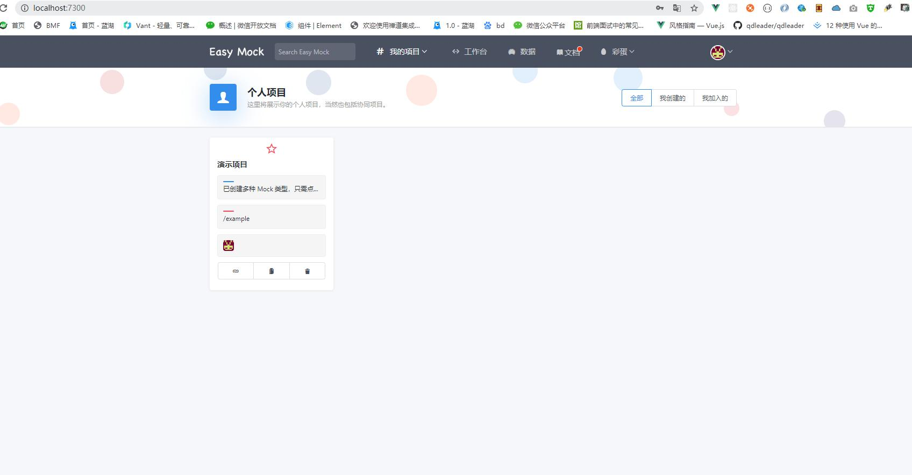

#### windows本地搭建easy-mock环境
 　　起因：由于easy-mock官网很不稳定，所以想搭建自己本地的mock环境

       1、首先安装node.js 环境 (提供地址：https://nodejs.org/en/)

       2、下载mongoDB 

			
			
			下载时候选择图形化工具，挺好用的，下载完后打开界面如图
			
			
			进来后因为没有设置密码直接点击，connect就可以
			
			然后你就连上啦。

   3、Redis安装
   
   我推荐一个傻瓜式安装redis的方法。
   首先下载phpstudy，[地址](https://www.xp.cn/download.html)然后里面后好多你用的工具可以统一下载和管理。特别方便。
   这里直接点立即下载就可以。
   
   
   a
   找到redis直接安装就可以。
   
   
   然后在首页点击启动就可以。

   4、安装下载easy mock  

         使用git工具

        　   git clone https://github.com/easy-mock/easy-mock.git

　　　　cd easy-mock
　　　　npm install   
　　　　npm run build
 
      安装完成后打开easy-mock文件夹下的config/default.json 
      检查：
       
        确定一致后，下载npm i -g cross-env pm2

       下载完成后运行环境变量  cross-env NODE_ENV=production pm2 start app.js

      

  　 从http://localhost:7300/打开easymock 的页面 ，开始使用 
  

        