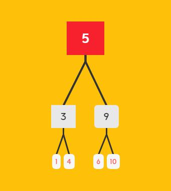

<!-- 二叉树 -->



相关知识点

>1节点： 树中的每个元素称为一个节点

>2根节点:位于整棵树顶点的节点，它没有父节点。

>3子节点：其他节点的后代

>4叶子节点：没有子节点的元素成为叶子节点

>5二叉树：二叉树就是一种数据结构，它的组织关系就像自然界的树一样。官方的定义为：是一个有限元素的集合。该集合或者为空，或者由一个称为根的元素，及两个不相交的，被分别称为左子树和右子树的二叉树组成。
 
>6二叉查找树：二叉查找树也叫二叉搜索树（BST）,它只允许我们在左节点存储比父节点更小的值，右节点存储比父节点更大的值，上图展示的就是一颗二叉查找树。

```
1.首先创建一个类，表示二叉查找树。

function BinarySearchTree() {
	var Node = function(key) {
		this.key = key;
		this.left = null;
		this.right = null
	}
	var root = null
}
```

<!-- 它还应该有一些方法：

insert(key) 插入一个新的键
inOrderTraverse() 对树进行中序遍历，并打印结果
preOrderTraverse() 对树进行先序遍历，并打印结果
postOrderTraverse() 对树进行后序遍历，并打印结果
search(key) 查找树中的键，如果存在返回true,不存在返回fasle
findMin() 返回树中的最小值
findMax() 返回树中的最大值
remove(key) 删除树中的某个键 -->

#向树中插入一个键

>向树中插入一个新的键，首页应该创建一个用来表示新节点的Node类实例，因此需要new一下Node类并传入需要插入的key值，它会自动初始化为左右节点为null的一个新节点

>然后，需要做一些判断先判断树是否为空，若为空，新插入的节点就作为根节点，如不为空，调用一个辅助方法insertNode()方法，将根节点和新节点传入

```
this.insert = function (key) {
	let newNode = new Node(key);
	if(root === null) {
		root = newNode
	} else {
		insertNode(root, newNode)
	}
}

```

>定义一下insertNode() 方法，这个方法会通过递归得调用自身，来找到新添加节点的合适位置

```
let insertNode = function(node, newNode) {
	if(newNode.key <= node.key) {
		if(node.left === null) {
			node.left = newNode
		} else {
			insertNode(node.left,newNode)
		}
	} else {
		if(node.right === null) {
			node.right = newNode
		} else {
			insertNode(node.right, newNode)
		}
	}
}
```


未完待续。。。